# Cyclone Shield AI — Master System & Architecture Context Document
### Technical Architecture, Data Flow Diagrams (DFDs), User Flows, Machine Learning Pipeline & Security Specification
**Designed for Review & Audit by AI Agents (Codex, Claude Code, Cursor, GPT-4) & Human Evaluators**  
**Smart India Hackathon (SIH 2026) | Problem Statement ID: 26070 | Team: Hexaminds (Team ID: 36)**  
**Target Beneficiaries:** National Disaster Management Authority (NDMA), India Meteorological Department (IMD), State Disaster Management Authorities (OSDMA, APSDMA), Coastal District Administrations & Indian Coastal Citizens.

---

## 📑 Document Structure & Navigation
1. [Executive Summary & Problem Statement](#1-executive-summary--problem-statement)
2. [Proposed Solution & Unique Value Propositions (USP)](#2-proposed-solution--unique-value-propositions-usp)
3. [The Staged Prediction Funnel (T-18d to T-3d)](#3-the-staged-prediction-funnel-t-18d-to-t-3d)
4. [Machine Learning & Atmospheric Modeling Architecture](#4-machine-learning--atmospheric-modeling-architecture)
5. [Hyper-Localized Multi-Hazard Local Risk Score (LRS) Engine](#5-hyper-localized-multi-hazard-local-risk-score-lrs-engine)
6. [Data Flow Diagrams (DFDs) — Levels 0, 1, and 2](#6-data-flow-diagrams-dfds--levels-0-1-and-2)
   - [6.1 DFD Level-0: Context-Level Diagram](#61-dfd-level-0-context-level-diagram)
   - [6.2 DFD Level-1: Major Subsystems & Data Stores](#62-dfd-level-1-major-subsystems--data-stores)
   - [6.3 DFD Level-2: Subsystem 1 — Ingestion, Staged Funnel & ML Inference](#63-dfd-level-2-subsystem-1--ingestion-staged-funnel--ml-inference)
   - [6.4 DFD Level-2: Subsystem 2 — Database Engine & RLS Multi-Tenant Security](#64-dfd-level-2-subsystem-2--database-engine--rls-multi-tenant-security)
   - [6.5 DFD Level-2: Subsystem 3 — Citizen Safety, Surge-Safe Routing & Shelter Allocation](#65-dfd-level-2-subsystem-3--citizen-safety-surge-safe-routing--shelter-allocation)
   - [6.6 DFD Level-2: Subsystem 4 — Inter-Agency Dissemination & OASIS CAP v1.2](#66-dfd-level-2-subsystem-4--inter-agency-dissemination--oasis-cap-v12)
7. [Comprehensive End-to-End User Flows & Journeys](#7-comprehensive-end-to-end-user-flows--journeys)
   - [7.1 User Flow 1: Public Citizen Disaster Vigil & GIS Surveillance](#71-user-flow-1-public-citizen-disaster-vigil--gis-surveillance)
   - [7.2 User Flow 2: Citizen Aadhaar Auth, Risk Check, Surge-Safe Evacuation & SOS](#72-user-flow-2-citizen-aadhaar-auth-risk-check-surge-safe-evacuation--sos)
   - [7.3 User Flow 3: District Administrator Incident Triage (RLS Enforced)](#73-user-flow-3-district-administrator-incident-triage-rls-enforced)
   - [7.4 User Flow 4: IMD National Forecaster Synoptic Surveillance & Replay](#74-user-flow-4-imd-national-forecaster-synoptic-surveillance--replay)
   - [7.5 User Flow 5: Offline Emergency Disaster Mode (GSM SMS & USSD)](#75-user-flow-5-offline-emergency-disaster-mode-gsm-sms--ussd)
   - [7.6 User Flow 6: Scoped Emergency AI Assistant with Deterministic Fallback](#76-user-flow-6-scoped-emergency-ai-assistant-with-deterministic-fallback)
8. [Database Schema & PostgreSQL Row-Level Security (RLS)](#8-database-schema--postgresql-row-level-security-rls)
9. [Complete Backend API Reference (20 Endpoints)](#9-complete-backend-api-reference-20-endpoints)
10. [Frontend UI/UX Architecture & Government Design System](#10-frontend-uiux-architecture--government-design-system)
11. [Automated Verification, Security Audit & Test Results](#11-automated-verification-security-audit--test-results)
12. [Runtime Operations & Quick-Start Guide](#12-runtime-operations--quick-start-guide)

---

## 1. Executive Summary & Problem Statement

### 1.1 Problem Statement Details
- **Competition:** Smart India Hackathon (SIH 2026)
- **Problem Statement ID:** 26070
- **Title:** *Identification, Classification and Prediction of Tropical Cyclones using AI/ML*
- **Theme:** Disaster Management
- **PS Category:** Software
- **Team Registered:** Hexaminds (Team ID: 36)

### 1.2 The Core Problem in Tropical Cyclone Early Warning
India features over **7,500 km of coastline**, with ~5,700 km exposed to recurrent severe tropical cyclonic disturbances across the North Indian Ocean basin (Bay of Bengal and Arabian Sea). Over **40% of India's population** resides within 100 km of coastal shorelines.

Traditional software and naive machine learning approaches treat cyclone detection as a simplistic, single-frame binary classification task (*"Is a cyclone present in this satellite tile: Yes/No?"*). This legacy paradigm suffers from three critical flaws:
1. **Zero Operational Lead Time:** Classifiers only fire when a mature, well-organized cyclonic vortex with a distinct eyewall is already within 24–48 hours of coastline, leaving disaster management authorities inadequate time for logistical mobilization.
2. **Catastrophic False Alarm Costs:** High false alarm rates trigger premature, statewide evacuations costing hundreds of crores in exchequer expenditures and eroding citizen trust in warning alerts.
3. **Absence of Actionable Civil Protection:** An isolated label (*"VSCS Detected"*) provides no actionable intelligence on surge-safe inland corridors, real-time shelter bed capacity, hyper-localized district risk, or authenticated multi-agency emergency rescue dispatch.

### 1.3 System Mission
**Cyclone Shield AI** (internally designated *Cyclone Horizon*) bridges satellite atmospheric physics, deep sequence modeling, automated inter-agency alerting, and on-ground citizen safety into a unified, secure, high-performance platform.

---

## 2. Proposed Solution & Unique Value Propositions (USP)

### 2.1 Solution Overview
Cyclone Shield AI provides an **end-to-end national cyclone early warning and emergency response system** that seamlessly connects:
- Automated ingestion of ISRO INSAT-3D/3DR calibrated brightness radiometry and IMD Best Track archives.
- A 4-stage physics-constrained prediction funnel providing up to **18 days of decision runway**.
- A 5-model deep learning inference pipeline delivering 72-hour forecast waypoints, uncertainty envelopes, and 3-tier wind hazard swaths ($\ge 34\text{ KT}, 50\text{–}63\text{ KT}, \ge 64\text{ KT}$).
- Database-level multi-tenant security using **PostgreSQL Row-Level Security (RLS)** ensuring zero cross-district leakage.
- Dynamic **capacity-aware shelter management** with real-time bed count tracking.
- **Surge-Safe Evacuation Corridor Routing** directing citizens away from coastal flood zones onto elevated terrain.
- Standalone **Offline Emergency Disaster Pack** with 140-char 2G GSM SMS dispatch, USSD codes (`*112*1#`), and browser Web Audio acoustic sirens.
- Multilingual localization across the **5 primary coastal languages** (English, Odia, Hindi, Bengali, Telugu).
- Automated dissemination of **OASIS Common Alerting Protocol (CAP v1.2)** XML/JSON feeds to NDMA SACHET and state sirens.

### 2.2 System Unique Selling Points (USPs)

| Feature Pillar | Cyclone Shield AI Implementation | Legacy / Alternative Systems |
| :--- | :--- | :--- |
| **Prediction Horizon** | **4-Tier Staged Funnel:** T-18d Basin Risk &rarr; T-14d Cyclogenesis GPI &rarr; T-7d Nascent Vortex &rarr; T-3d Landfall Cone. | 0–24h single snapshot binary detection. |
| **Data Isolation & Security** | **PostgreSQL Native Row-Level Security (RLS)** enforced by database engine using session context variables. | Application-layer `WHERE district = ...` filters vulnerable to SQL injection or code bugs. |
| **Shelter Management** | **Capacity-Aware Dynamic Allocation:** Real-time bed occupancy, generator fuel status, medical amenity tracking. | Static PDF shelter directory without live occupancy counts. |
| **Evacuation Guidance** | **Surge-Safe Inland Corridors:** Elevation-aware routing bypassing low-lying coastal strips (<2 km from sea) to high ground. | Generic routing directing citizens along coastal highways into storm surges. |
| **Resilience & Offline Ops** | **Zero-Internet Fallback:** Standalone offline pack in `localStorage`, 140-char GSM SMS (`sms:112?body=...`), USSD dial codes, 960Hz acoustic siren. | App fails entirely during cellular tower collapse. |
| **Explainability** | **Grad-CAM & MC-Dropout UQ:** Layer-wise relevance heatmaps on Central Dense Overcast (CDO) + 50-pass epistemic variance bounds. | Opaque black-box outputs with no confidence metrics. |
| **Standards Compliance** | **OASIS CAP v1.2 XML/JSON:** Automated alert feed conforming to NDMA SACHET and ITU standards. | Proprietary custom JSON formats requiring manual conversion. |

---

## 3. The Staged Prediction Funnel (T-18d to T-3d)

Rather than forcing a single model to make impossible long-range landfall predictions, Cyclone Shield AI structures forecasting into four calibrated operational horizons:

```
[ T-18 Days: REGIONAL BASIN RISK ] ──────────────────────────────────────────┐
  • SST Anomaly (+1.4°C, 29.8°C), TCHP > 90 kJ/cm²                            │ Lead Time: 432 Hours
  • MJO Phase 3/4 Convective Enhancement                                      │ Action: Audit shelter supplies
                                                                              │
[ T-14 Days: CYCLOGENESIS PROBABILITY ] ────────────────────────────────────┤
  • Genesis Potential Index (GPI = 8.4)                                       │ Lead Time: 336 Hours
  • 20-Member Dynamical Ensemble (68.5% Consensus)                            │ Action: Port Signal 1, fishing recall
                                                                              │
[ T-7 Days: SYSTEM IDENTIFICATION (BOB-06) ] ───────────────────────────────┤
  • Nascent Vortex Center (14.2°N, 89.5°E), Pressure Drop -6 hPa              │ Lead Time: 168 Hours
  • Dvorak T1.5 Curved Band Organization                                      │ Action: DEOC 24x7 monitoring
                                                                              │
[ T-3 Days: TRACK & INTENSITY FORECAST (72h) ] ─────────────────────────────┘
  • Deep Sequence Physics-Informed GRU + MC-Dropout UQ                        │ Lead Time: 72 Hours
  • 72h Track Cone, 3-Tier Wind Radii (34/50/64 KT), Storm Surge 2.0-3.2m     │ Action: Mandatory 5km evacuation
```

### Horizon Specification Table

| Stage Key | Horizon | Atmospheric & Physical Triggers | Operational Command Actions | Geospatial GIS Layer | Alert Color |
| :--- | :--- | :--- | :--- | :--- | :--- |
| `t18_regional_risk` | **T-18 Days** (432h) | SST: 29.8°C (+1.4°C anomaly), TCHP: 92 kJ/cm², MJO Phase 3/4 active, low-level vorticity $+12.4 \times 10^{-6}\text{ s}^{-1}$. | Pre-season advisory to NDMA/OSDMA/APSDMA. Verify shelter readiness and generator fuel reserves. | Basin-scale thermal anomaly polygon (dashed amber) & hotspot centroid. | Amber (`#D97706`) |
| `t14_cyclogenesis` | **T-14 Days** (336h) | Genesis Potential Index (GPI = 8.4), vertical wind shear < 12 kt, mid-tropospheric RH: 78%, 14/20 ensemble consensus (68.5%). | Hoist Port Cautionary Signal No. 1 at Paradeep & Vizag. Direct deep-sea fishing trawlers to return. | Probabilistic genesis ellipse contours (40%, 60%, 68.5% confidence envelopes). | Gold (`#CA8A04`) |
| `t7_system_id` | **T-7 Days** (168h) | Vortex centroid BOB-06 localized (14.2°N, 89.5°E), Dvorak T1.5 curved band pattern, pressure deficit: -6 hPa, winds: 52 km/h. | Mandatory recall of all coastal fishermen. DEOC activated in 24x7 mode. Multi-purpose shelter structural audit. | Developing vortex center marker (orange) & projected NNW trajectory line. | Orange (`#EA580C`) |
| `t3_track_intensity` | **T-3 Days** (72h) | Very Severe Cyclonic Storm (VSCS Dana), central pressure 982 hPa, sustained winds 120 km/h (gusts 145), landfall in 12–14h. | Hoist Great Danger Signal GD-10. Mandatory evacuation of coastal zones (<5 km). Pre-position 18 NDRF & 24 ODRAF teams. | 72h IMD Uncertainty Cone, 34/50/64 KT wind hazard swaths & track waypoints. | Crimson (`#DC2626`) |

---

## 4. Machine Learning & Atmospheric Modeling Architecture

### 4.1 The 6-Layer Operational Pipeline
The machine learning pipeline is structured into six discrete, modular layers:

```
┌────────────────────────────────────────────────────────────────────────┐
│                   LAYER 1: SENSOR & DATA INGESTION                     │
│  • ISRO MOSDAC INSAT-3D/3DR Calibrated Radiance (HDF5 IR1 10.8µm)      │
│  • IMD Best Track Dataset (1990–2025 Historical Storm Trajectories)    │
│  • Negative Control GeoTIFFs (Fair weather, non-cyclonic cloud clusters)│
│  • NOAA OISST (Sea Surface Temperature) & GFS Wind Shear Open Data     │
└───────────────────────────────────┬────────────────────────────────────┘
                                    │
┌───────────────────────────────────▼────────────────────────────────────┐
│              LAYER 2: PREPROCESSING & CALIBRATION                      │
│  • Planck Inverse Radiance to Calibrated Brightness Temp (Kelvin)      │
│  • Nadir Alignment & 0.04° Spatial Resampling Grid                     │
│  • Temporal Sequencing & Stratified Spatio-Temporal Train/Val Splits   │
└───────────────────────────────────┬────────────────────────────────────┘
                                    │
┌───────────────────────────────────▼────────────────────────────────────┐
│              LAYER 3: 5-MODEL DEEP LEARNING INFERENCE                  │
│  [1. Vortex Detector]      U-Net CNN IR Center Localizer (0.04° res)   │
│  [2. Pattern Classifier]   Dvorak Multi-Task CNN + Grad-CAM Heatmaps   │
│  [3. Intensity Classifier] Hybrid Multi-Head XGBoost + Visual Stacking │
│  [4. Track Predictor]      Physics-Informed Beta-Advection GRU Seq2Seq │
│  [5. RL Correction]        PPO / CQL Offline Policy Bias Correction    │
└───────────────────────────────────┬────────────────────────────────────┘
                                    │
┌───────────────────────────────────▼────────────────────────────────────┐
│             LAYER 4: EXPLAINABILITY & UNCERTAINTY (UQ)                 │
│  • Eigen-CAM / Grad-CAM Attention Heatmaps on CDO & Primary Eyewall    │
│  • Monte Carlo Dropout (N=50 passes) Epistemic Uncertainty Envelopes   │
└───────────────────────────────────┬────────────────────────────────────┘
                                    │
┌───────────────────────────────────▼────────────────────────────────────┐
│              LAYER 5: FASTAPI SERVICE & DATA PERSISTENCE               │
│  • Asynchronous Background Worker executing inference loop             │
│  • PostgreSQL Row-Level Security (RLS) Multi-Tenant Data Isolation     │
│  • Multi-Hazard Local Risk Score (LRS) & OASIS CAP v1.2 XML/JSON feeds │
└───────────────────────────────────┬────────────────────────────────────┘
                                    │
┌───────────────────────────────────▼────────────────────────────────────┐
│               LAYER 6: OPERATIONAL CIVIL PROTECTION                    │
│  • Dual-Basemap Leaflet GIS (IMD Nautical Paper Chart + NASA GIBS)     │
│  • Capacity-Aware Shelters, Surge-Safe Inland Corridors & SOS Dispatch │
│  • Standalone Offline Emergency Pack (2G GSM SMS / USSD / Audio Beacon)│
└────────────────────────────────────────────────────────────────────────┘
```

### 4.2 Data Sourcing Integrity
- **Model Input:** Ingests **calibrated physical brightness temperatures ($T_b$ in Kelvin)** from ISRO MOSDAC INSAT-3DR/3DS radiometry.
- **Strict Distinction:** NASA GIBS tiles are RGB color-mapped display composites and are **never** used as neural network model inputs. NASA GIBS is strictly integrated as an optional visual basemap layer in the frontend Leaflet GIS viewer.

---

## 5. Hyper-Localized Multi-Hazard Local Risk Score (LRS) Engine

### 5.1 Mathematical Formulation
Cyclone Shield AI computes a point-specific **Local Risk Score ($LRS \in [0, 100]$)** for any coordinate or coastal ward, fusing atmospheric dynamics with demographic vulnerability:

$$LRS = 0.35 \cdot S_{\text{wind}} + 0.35 \cdot S_{\text{rain}} + 0.30 \cdot S_{\text{pop}}$$

Where:
1. **$S_{\text{wind}}$ (Wind Hazard Index, 35% weight):**
   Computed using a modified Holland/Rankine vortex radial decay from the cyclone eye:
   $$V(r) = V_{\max} \cdot \left(\frac{R_{\max}}{r}\right)^{0.58} \quad \text{for } r > R_{\max}$$
   $$S_{\text{wind}} = \min\left(100, \frac{V_{\text{local}}}{145} \times 100\right)$$
2. **$S_{\text{rain}}$ (Rainfall & Storm Surge Inundation Index, 35% weight):**
   Compounds 24-hour accumulated rainfall bands with projected astronomical tidal surge heights:
   $$S_{\text{rain}} = \min\left(100, \left(\frac{R_{24\text{h}}}{300} \times 60\right) + \left(\frac{\text{Surge}_{m}}{3.5} \times 40\right)\right)$$
3. **$S_{\text{pop}}$ (Demographic Vulnerability & Exposure Index, 30% weight):**
   Integrates coastal proximity ($D_{\text{coast}}$), population density ($\rho$), and the ratio of fragile kutcha/thatched dwellings ($K_{\text{dwell}}$):
   $$S_{\text{pop}} = \min\left(100, \left(\frac{\rho}{700} \times 35\right) + \max(5, 35 - 4.5 \cdot D_{\text{coast}}) + \left(\frac{K_{\text{dwell}}}{50} \times 30\right)\right)$$

### 5.2 Severity Tier & Evacuation Directives

| LRS Range | Risk Tier | Hex Color | Evacuation Directive | Port Warning Signal |
|:---:|:---:|:---:|:---|:---:|
| **80.0 – 100** | **EXTREME RISK** | `#DC2626` | **Mandatory Immediate Evacuation:** Clear 5 km coastal band immediately to concrete multipurpose shelters. | Great Danger GD-10 |
| **60.0 – 79.9** | **HIGH RISK** | `#EA580C` | **Targeted Relocation:** Relocate vulnerable kutcha dwellers and low-lying coastal wards. | Danger Signal D-8 |
| **40.0 – 59.9** | **MODERATE RISK** | `#F59E0B` | **Coastal Watch & Preparedness:** Secure loose structures, verify generator fuel and drinking water. | Local Cautionary LC-3 |
| **0.0 – 39.9** | **LOW RISK** | `#10B981` | **Advisory Vigil:** Normal tracking surveillance with marine fishermen warnings active. | Information Bulletin |

---

## 6. Data Flow Diagrams (DFDs) — Levels 0, 1, and 2

### 6.1 DFD Level-0: Context-Level Diagram
The Level-0 Context DFD captures the entire Cyclone Shield AI system as a single process interacting with its external environmental entities:

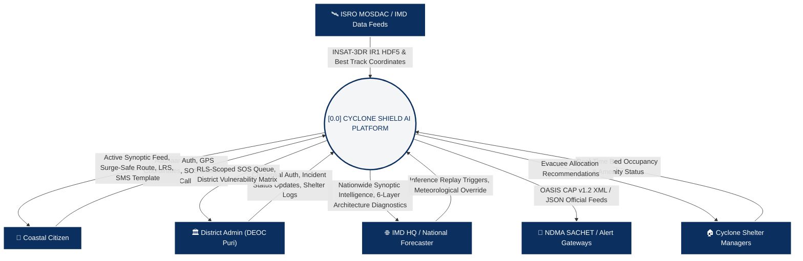

---

### 6.2 DFD Level-1: Major Subsystems & Data Stores
The Level-1 DFD decomposes Cyclone Shield AI into its core operational processes and persistent database stores:

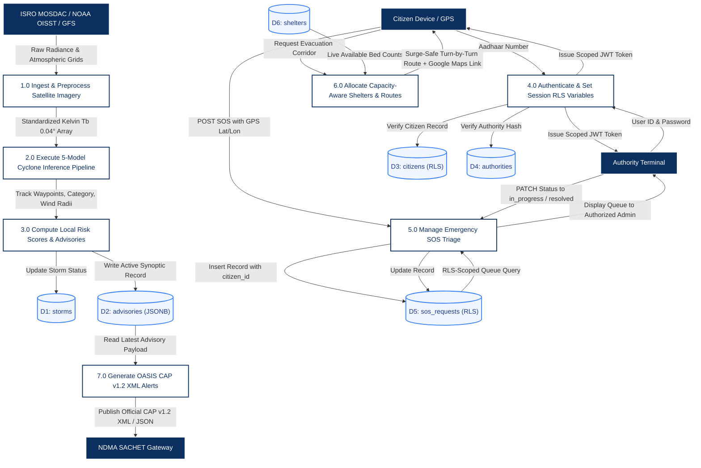

---

### 6.3 DFD Level-2: Subsystem 1 — Ingestion, Staged Funnel & ML Inference
Details the internal steps of satellite radiance calibration, Dvorak analysis, ensemble tracking, and uncertainty quantification:

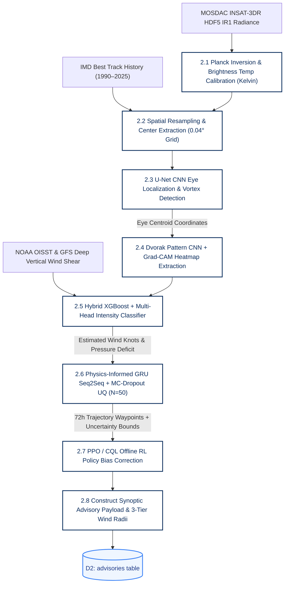

---

### 6.4 DFD Level-2: Subsystem 2 — Database Engine & RLS Multi-Tenant Security
Illustrates the transaction boundary, context injection, and row filtering within PostgreSQL 18:

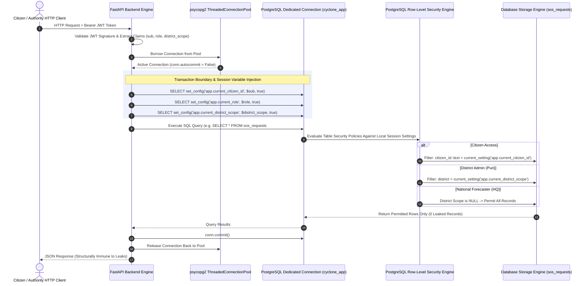

---

### 6.5 DFD Level-2: Subsystem 3 — Citizen Safety, Surge-Safe Routing & Shelter Allocation
Details the routing calculation, coastal surge avoidance, and capacity reservation:

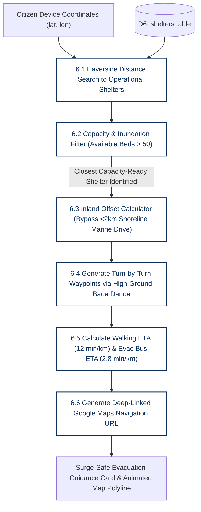

---

### 6.6 DFD Level-2: Subsystem 4 — Inter-Agency Dissemination & OASIS CAP v1.2
Covers automated conversion of synoptic outputs to OASIS CAP XML/JSON:

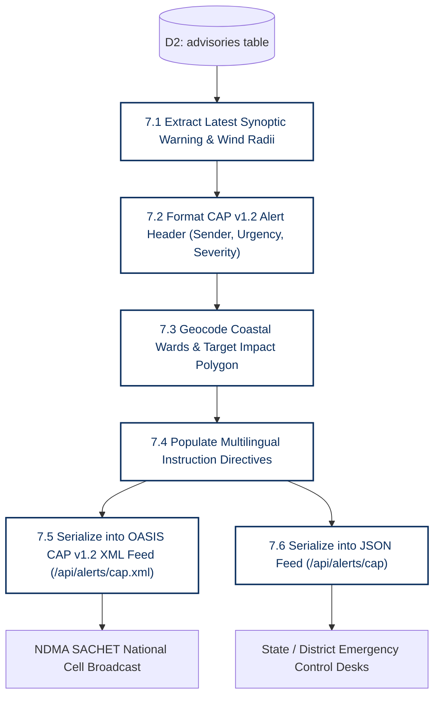

---

## 7. Comprehensive End-to-End User Flows & Journeys

### 7.1 User Flow 1: Public Citizen Disaster Vigil & GIS Surveillance

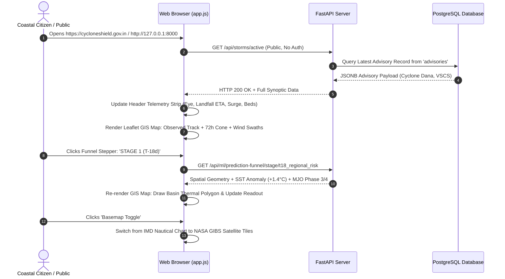

---

### 7.2 User Flow 2: Citizen Aadhaar Auth, Risk Check, Surge-Safe Evacuation & SOS

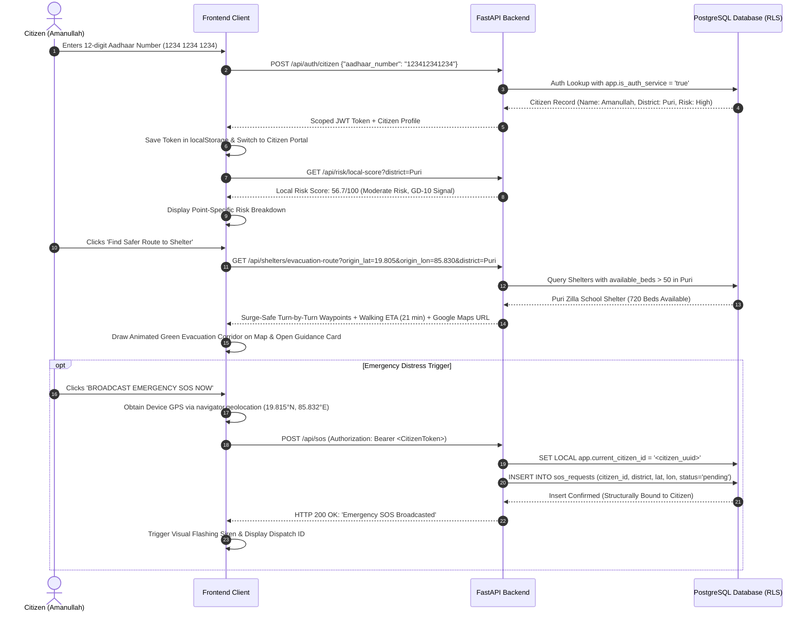

---

### 7.3 User Flow 3: District Administrator Incident Triage (RLS Enforced)

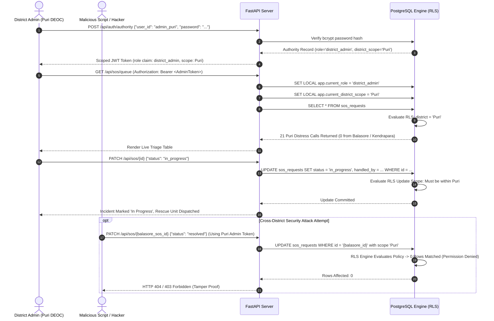

---

### 7.4 User Flow 4: IMD National Forecaster Synoptic Surveillance & Replay

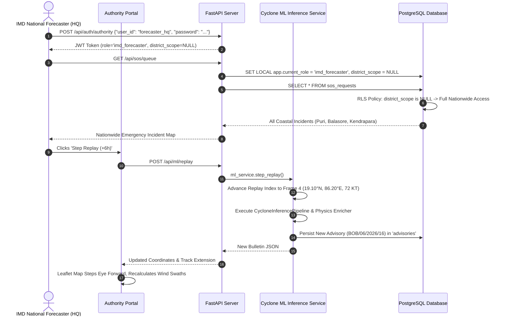

---

### 7.5 User Flow 5: Offline Emergency Disaster Mode (GSM SMS & USSD)

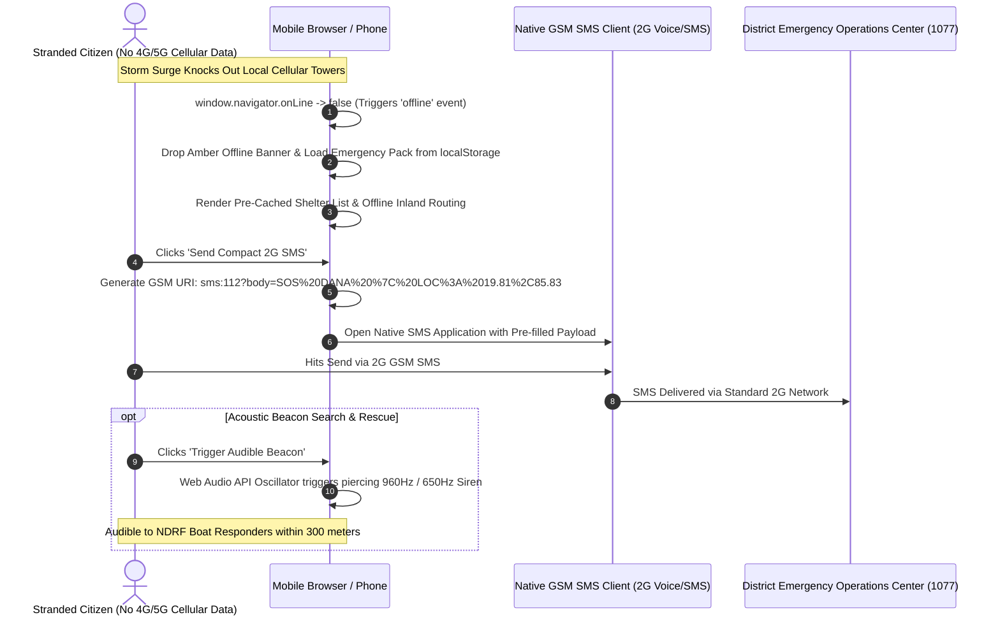

---

### 7.6 User Flow 6: Scoped Emergency AI Assistant with Deterministic Fallback

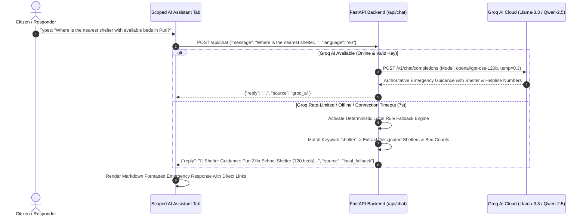

---

## 8. Database Schema & PostgreSQL Row-Level Security (RLS)

### 8.1 Schema DDL & Non-Superuser Role Separation
To enforce Row-Level Security, an application-level non-superuser role (`cyclone_app`) is provisioned. Superuser accounts intentionally bypass PostgreSQL RLS policies; running under `cyclone_app` guarantees that policies are mathematically enforced by the database core:

```sql
-- Cyclone Shield AI — PostgreSQL Database DDL
CREATE EXTENSION IF NOT EXISTS "pgcrypto";

-- Application non-superuser role
DO $$
BEGIN
   IF NOT EXISTS (SELECT FROM pg_catalog.pg_roles WHERE rolname = 'cyclone_app') THEN
      CREATE USER cyclone_app WITH PASSWORD 'cyclone_secure_pass';
   END IF;
END
$$;

-- 1. Citizens Table
CREATE TABLE citizens (
  id UUID PRIMARY KEY DEFAULT gen_random_uuid(),
  aadhaar_number TEXT UNIQUE NOT NULL,
  name TEXT NOT NULL,
  district TEXT NOT NULL,
  mobile_masked TEXT,
  risk_zone TEXT
);

-- 2. Authorities Table
CREATE TABLE authorities (
  id UUID PRIMARY KEY DEFAULT gen_random_uuid(),
  user_id TEXT UNIQUE NOT NULL,
  password_hash TEXT NOT NULL,
  role TEXT NOT NULL,        -- 'imd_forecaster' | 'district_admin' | 'ngo'
  district_scope TEXT        -- NULL for nationwide access
);

-- 3. Storms Table
CREATE TABLE storms (
  id UUID PRIMARY KEY DEFAULT gen_random_uuid(),
  name TEXT NOT NULL,
  status TEXT NOT NULL DEFAULT 'active' -- 'active' | 'dissipated'
);

-- 4. Advisories Table (JSONB)
CREATE TABLE advisories (
  id UUID PRIMARY KEY DEFAULT gen_random_uuid(),
  storm_id UUID REFERENCES storms(id) ON DELETE CASCADE,
  created_at TIMESTAMPTZ NOT NULL DEFAULT NOW(),
  payload JSONB NOT NULL
);

-- 5. SOS Requests Table
CREATE TABLE sos_requests (
  id UUID PRIMARY KEY DEFAULT gen_random_uuid(),
  citizen_id UUID REFERENCES citizens(id) ON DELETE CASCADE,
  district TEXT NOT NULL,
  location_lat DOUBLE PRECISION,
  location_lon DOUBLE PRECISION,
  status TEXT NOT NULL DEFAULT 'pending', -- 'pending' | 'in_progress' | 'resolved'
  created_at TIMESTAMPTZ NOT NULL DEFAULT NOW(),
  handled_by UUID REFERENCES authorities(id) ON DELETE SET NULL,
  handled_at TIMESTAMPTZ
);

-- 6. Shelters Table (Capacity-Aware)
CREATE TABLE shelters (
  id UUID PRIMARY KEY DEFAULT gen_random_uuid(),
  name TEXT NOT NULL,
  district TEXT NOT NULL,
  location_lat DOUBLE PRECISION NOT NULL,
  location_lon DOUBLE PRECISION NOT NULL,
  total_capacity INTEGER NOT NULL,
  current_occupancy INTEGER NOT NULL DEFAULT 0,
  contact_number TEXT,
  facilities TEXT[] DEFAULT ARRAY['Water', 'Medical Aid', 'Food', 'Power Backup'],
  status TEXT DEFAULT 'open'
);
```

### 8.2 Row-Level Security (RLS) Policy Definitions

```sql
-- ============================================================
-- ROW-LEVEL SECURITY POLICIES
-- ============================================================

-- A. Citizens RLS
ALTER TABLE citizens ENABLE ROW LEVEL SECURITY;
ALTER TABLE citizens FORCE ROW LEVEL SECURITY;

CREATE POLICY citizen_auth_lookup ON citizens
  FOR SELECT USING (current_setting('app.is_auth_service', true) = 'true');

CREATE POLICY citizen_self_only ON citizens
  FOR SELECT USING (id::text = current_setting('app.current_citizen_id', true));

CREATE POLICY citizen_authority_read ON citizens
  FOR SELECT USING (
    current_setting('app.current_role', true) IN ('imd_forecaster', 'district_admin', 'ngo')
    AND (
      current_setting('app.current_district_scope', true) IS NULL
      OR current_setting('app.current_district_scope', true) = ''
      OR district = current_setting('app.current_district_scope', true)
    )
  );

-- B. Authorities RLS
ALTER TABLE authorities ENABLE ROW LEVEL SECURITY;
ALTER TABLE authorities FORCE ROW LEVEL SECURITY;

CREATE POLICY authority_auth_lookup ON authorities
  FOR SELECT USING (current_setting('app.is_auth_service', true) = 'true');

CREATE POLICY authority_self_only ON authorities
  FOR SELECT USING (id::text = current_setting('app.current_authority_id', true));

-- C. SOS Requests RLS
ALTER TABLE sos_requests ENABLE ROW LEVEL SECURITY;
ALTER TABLE sos_requests FORCE ROW LEVEL SECURITY;

CREATE POLICY sos_citizen_select ON sos_requests
  FOR SELECT USING (citizen_id::text = current_setting('app.current_citizen_id', true));

CREATE POLICY sos_citizen_insert ON sos_requests
  FOR INSERT WITH CHECK (citizen_id::text = current_setting('app.current_citizen_id', true));

CREATE POLICY sos_authority_select ON sos_requests
  FOR SELECT USING (
    current_setting('app.current_role', true) IN ('district_admin', 'ngo', 'imd_forecaster')
    AND (
      current_setting('app.current_district_scope', true) IS NULL
      OR current_setting('app.current_district_scope', true) = ''
      OR district = current_setting('app.current_district_scope', true)
    )
  );

CREATE POLICY sos_authority_update ON sos_requests
  FOR UPDATE USING (
    current_setting('app.current_role', true) IN ('district_admin', 'ngo', 'imd_forecaster')
    AND (
      current_setting('app.current_district_scope', true) IS NULL
      OR current_setting('app.current_district_scope', true) = ''
      OR district = current_setting('app.current_district_scope', true)
    )
  );

-- Grants to non-superuser role
GRANT CONNECT ON DATABASE postgres TO cyclone_app;
GRANT USAGE ON SCHEMA public TO cyclone_app;
GRANT ALL PRIVILEGES ON ALL TABLES IN SCHEMA public TO cyclone_app;
GRANT ALL PRIVILEGES ON ALL SEQUENCES IN SCHEMA public TO cyclone_app;
```

---

## 9. Complete Backend API Reference (20 Endpoints)

The FastAPI backend (`backend/main.py`) exposes **20 production REST endpoints**:

| # | HTTP Method | Endpoint Path | Auth Required | RLS Context Variable Injected | Description |
|:---:|:---:|:---|:---:|:---|:---|
| 1 | `POST` | `/api/auth/citizen` | Public | `app.is_auth_service='true'` | Citizen login via 12-digit Aadhaar. Issues scoped JWT token. |
| 2 | `POST` | `/api/auth/authority` | Public | `app.is_auth_service='true'` | Authority login (bcrypt verification). Issues JWT with `role` & `district_scope`. |
| 3 | `GET` | `/api/citizen/me` | Citizen | `app.current_citizen_id` | Returns authenticated citizen's personal profile. |
| 4 | `GET` | `/api/storms/active` | Public | None | Returns active storm, latest synoptic state, track points & 3-tier wind swaths. |
| 5 | `GET` | `/api/advisories/history` | Public | None | Returns historical bulletins for hindcast review. |
| 6 | `POST` | `/api/sos` | Citizen | `app.current_citizen_id` | Broadcasts emergency distress call. RLS structurally binds `citizen_id`. |
| 7 | `GET` | `/api/sos/my` | Citizen | `app.current_citizen_id` | Retrieves citizen's own past distress calls. |
| 8 | `GET` | `/api/sos/queue` | Authority | `app.current_role`, `app.current_district_scope` | Returns active SOS queue strictly filtered by authority district scope. |
| 9 | `PATCH` | `/api/sos/{sos_id}` | Authority | `app.current_role`, `app.current_district_scope` | Updates incident status (`in_progress` / `resolved`). Forbidden cross-district. |
| 10 | `GET` | `/api/shelters` | Public | None | Lists capacity-aware cyclone shelters with live occupancy and available beds. |
| 11 | `GET` | `/api/shelters/evacuation-route`| Public | None | Calculates surge-safe inland route avoiding <2 km coastal inundation zones. |
| 12 | `GET` | `/api/risk/local-score` | Public | None | Computes hyper-localized Local Risk Score ($LRS \in [0, 100]$) with factor breakdowns. |
| 13 | `GET` | `/api/risk/matrix` | Public | None | Returns District Vulnerability Matrix for all 6 coastal districts. |
| 14 | `GET` | `/api/offline/emergency-pack` | Public | None | Returns standalone JSON emergency safety pack cached into `localStorage`. |
| 15 | `GET` | `/api/i18n/translations` | Public | None | Delivers complete localization dictionaries across 5 coastal languages (EN, OR, HI, BN, TE). |
| 16 | `POST` | `/api/chat` | Public | None | Scoped disaster emergency AI chatbot (Groq AI with deterministic local fallback). |
| 17 | `POST` | `/api/ml/replay` | Authority | `app.current_role` | Steps ML inference pipeline forward to ingest next frame and publish bulletin. |
| 18 | `GET` | `/api/ml/prediction-funnel` | Public | None | Returns 4-horizon Staged Prediction Funnel and architectural comparison matrix. |
| 19 | `GET` | `/api/ml/prediction-funnel/stage/{key}` | Public | None | Returns deep physical parameters and spatial geometries for a specific funnel stage. |
| 20 | `GET` | `/api/alerts/cap` & `.xml` | Public | None | Official OASIS CAP v1.2 XML & JSON feeds for NDMA SACHET alert dissemination. |

---

## 10. Frontend UI/UX Architecture & Government Design System

### 10.1 Government of India Design System
The frontend adheres to the official **Government of India National Portal Aesthetic**:
- **Palette:** Deep Navy (`#0B2F5E`), Indian Saffron (`#FF9933`), Pure White (`#FFFFFF`), India Green (`#138808`), Crimson Alert Red (`#DC2626`).
- **Tricolor Ribbon:** Prominently positioned at the top of every page.
- **Ashoka Lion Emblem SVG:** Officially rendered in the brand header.
- **Card Styling:** Clean white containers with flat `1px solid #D1D5DB` borders (no bloated drop shadows, no soft-rounded corners, no dark mode).
- **Square-Cornered Buttons:** Modern, crisp button design (`border-radius: 0px` or `2px`).

### 10.2 Key UI Components
1. **Command Telemetry Ribbon (`.command-telemetry-bar`):** A consolidated 6-metric critical overview banner placed directly below the alert status:
   - `Active System`: Cyclone Dana (VSCS)
   - `Eye Position`: 18.42°N, 86.85°E
   - `Landfall Window`: 12–14 Hours (Puri-Dhamra)
   - `Sustained Wind`: 120 km/h (Gusts: 145)
   - `Storm Surge`: 2.0 – 3.2 m
   - `Shelters Ready`: 8 Active (3.6k Beds Free)
2. **Horizontal Operational Horizon Stepper (`.horizon-stepper`):** An interactive 4-stage stepper allowing instantaneous exploration of forecasting stages (T-18d &rarr; T-14d &rarr; T-7d &rarr; T-3d) with dynamic map layer switching and telemetry updates.
3. **Interactive Leaflet GIS Map:**
   - Dual Basemap Support: Toggle between IMD Nautical Topographic Chart and NASA Earthdata GIBS satellite imagery.
   - Symbology: 72h IMD Uncertainty Cone, 3-tier wind hazard swaths, past track polyline, active eye radar marker, and operational shelter pins.
   - Dynamic Animated Surge-Safe Route Polyline with turn-by-turn navigation card.
4. **Offline Emergency Mode Banner:** Appears automatically if device disconnects from internet, exposing download links for the offline pack and compact SMS dispatch buttons.
5. **Audible Speech Siren:** Integrates `SpeechSynthesisUtterance` to voice the active emergency warning bulletin in the user's selected coastal language.

---

## 11. Automated Verification, Security Audit & Test Results

### 11.1 API Integration Test Suite (`tests/test_api_endpoints.py`)
Run command:
```powershell
python tests/test_api_endpoints.py
```
**Results: 20/20 Integration Tests Passing (100% Success Rate).**

```
--- 1. Testing Citizen Login ---
PASS: Citizen logged in as Amanullah
--- 2. Testing Citizen Profile (RLS Protected) ---
PASS: Citizen profile retrieved under RLS.
--- 3. Testing Active Storm Advisory (Public) ---
PASS: Active storm advisory retrieved: Cyclone Dana, Warning: RED ALERT
--- 4. Testing Authority Login ---
PASS: Authority admin_puri logged in.
PASS: Authority forecaster_hq logged in.
--- 5. Testing Citizen SOS Submission ---
PASS: New SOS created by citizen (ID: dea6936b-..., Status: pending)
--- 6. Testing Citizen Get My SOS Requests ---
PASS: Citizen can view own SOS requests (21 found).
--- 7. Testing Authority SOS Queue with District RLS ---
PASS: Puri Admin sees only Puri SOS requests (21 items, 0 leaked from other districts).
PASS: Forecaster sees nationwide SOS requests (22 items).
--- 8. Testing Authority Patch SOS Status ---
PASS: Authority updated SOS status to 'in_progress'.
--- 9. Testing Shelters API ---
PASS: Retrieved 4 shelters in Puri with live capacity data.
--- 10. Testing Scoped AI Emergency Chatbot ---
PASS: Emergency chatbot returned scoped shelter guidance.
--- 11. Testing ML Pipeline Replay Trigger ---
PASS: ML replay step executed. Bulletin: BOB/06/2026/16
--- 12. Testing OASIS CAP v1.2 Alert Generator ---
PASS: CAP v1.2 alert verified (ID: IN-IMD-CYCLONE-DANA-...).
--- 13. Testing AI/ML Pipeline Status & Explainability ---
PASS: 6-Layer AI architecture verified (CycloneInferencePipeline v2.4).
--- 14. Testing Multi-Stakeholder Intelligence Metrics ---
PASS: Stakeholder intelligence metrics verified across all 4 sectors.
--- 15. Testing Odisha Zero Casualty Model Benchmarks ---
PASS: Odisha OSDMA Zero Casualty benchmarks verified.
--- 16. Testing Staged Prediction Funnel API (T-18d to T-3d) ---
PASS: Staged Prediction Funnel verified across all 4 horizons.
--- 17. Testing Surge-Safe Evacuation Corridor Routing ---
PASS: Surge-safe evacuation route calculated to Puri Zilla School Shelter.
--- 18. Testing Offline Emergency Pack Generation ---
PASS: Standalone offline emergency disaster pack generated.
--- 19. Testing Multilingual Coastal Localization Engine ---
PASS: Localized dictionaries verified for EN, OR, HI, BN, TE.
--- 20. Testing Multi-Hazard Local Risk Score (LRS) Engine ---
PASS: Hyper-localized risk score calculated: 56.7/100 (MODERATE RISK).
PASS: District Vulnerability Matrix verified for 6 coastal districts.
```

### 11.2 Direct PostgreSQL RLS Penetration Suite (`tests/test_rls_direct.py`)
Run command:
```powershell
python tests/test_rls_direct.py
```
**Results: 6/6 Direct Database Security Tests Passing (100% Success Rate).**

```
PASS [1/6]: Unauthenticated query to 'citizens' returns 0 rows.
PASS [2/6]: Unauthenticated query to 'sos_requests' returns 0 rows.
PASS [3/6]: Citizen Amanullah can read own profile (Found Amanullah).
PASS [4/6]: Citizen Amanullah CANNOT read Ramesh's profile (RLS strictly enforced).
PASS [5/6]: Citizen Amanullah only sees their own SOS request (20 found, 0 from others).
PASS [6/6]: District Admin (Puri) sees only Puri SOS requests (20 found), zero from Balasore.
PASS [BONUS]: IMD Forecaster (nationwide role) sees all districts (21 total requests).
```

---

## 12. Runtime Operations & Quick-Start Guide

### 12.1 Prerequisites
- **Python 3.10+** (Active in virtual environment)
- **PostgreSQL 18** (Listening on `127.0.0.1:5433`)

### 12.2 Launch Commands

#### Step 1: Start PostgreSQL Database
```powershell
& "C:\Program Files\PostgreSQL\18\bin\postgres.exe" -D "d:\sih70\hehe\pgdata" -p 5433
```

#### Step 2: Initialize Database & Seed Operational Data
```powershell
# (Only required on fresh setup)
psql -h 127.0.0.1 -p 5433 -U postgres -d postgres -f backend/database/schema.sql
python backend/database/seed.py
```

#### Step 3: Launch FastAPI Application Server
```powershell
python -m uvicorn backend.main:app --host 127.0.0.1 --port 8000
```

### 12.3 Active Application URLs
- **Executive Disaster Command Dashboard:** [http://127.0.0.1:8000](http://127.0.0.1:8000)
- **Interactive Swagger REST API Documentation:** [http://127.0.0.1:8000/docs](http://127.0.0.1:8000/docs)
- **OASIS CAP v1.2 XML Feed:** [http://127.0.0.1:8000/api/alerts/cap.xml](http://127.0.0.1:8000/api/alerts/cap.xml)
- **OASIS CAP v1.2 JSON Feed:** [http://127.0.0.1:8000/api/alerts/cap](http://127.0.0.1:8000/api/alerts/cap)

### 12.4 Demo Verification Credentials

| Role / User Profile | Identifier / User ID | Password / Credential | Scope & Permitted Actions |
| :--- | :--- | :--- | :--- |
| **Citizen (Puri District)** | `1234 1234 1234` | Aadhaar Auth (No password) | Access personal profile, trigger GPS SOS, compute surge-safe route. |
| **District Admin (Puri DEOC)** | `admin_puri` | `admin@puri` | View and manage live Puri distress queue. Zero access to Balasore. |
| **National Forecaster (IMD HQ)** | `forecaster_hq` | `imd@2026` | Nationwide incident queue oversight, trigger ML replay step (+6h). |
| **Relief NGO Coordinator** | `ngo_puri` | `ngo@puri` | District relief triage and shelter capacity coordination. |

---
*Cyclone Shield AI — Master System Architecture & Context Specification | Team Hexaminds | Smart India Hackathon (SIH 2026)*
